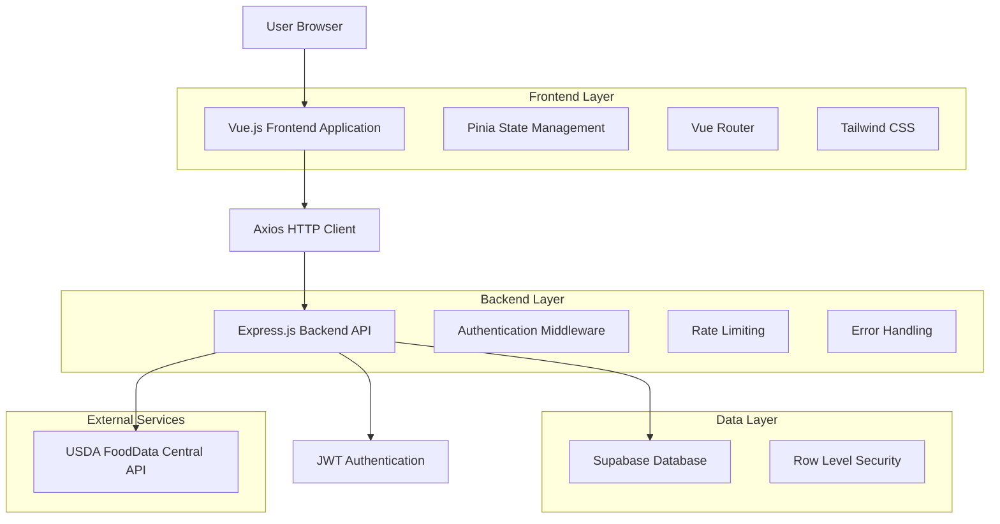
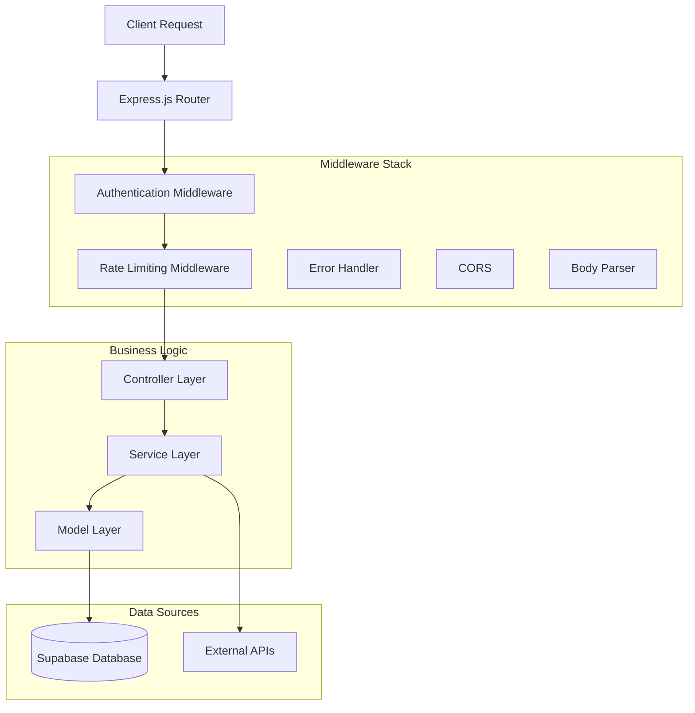
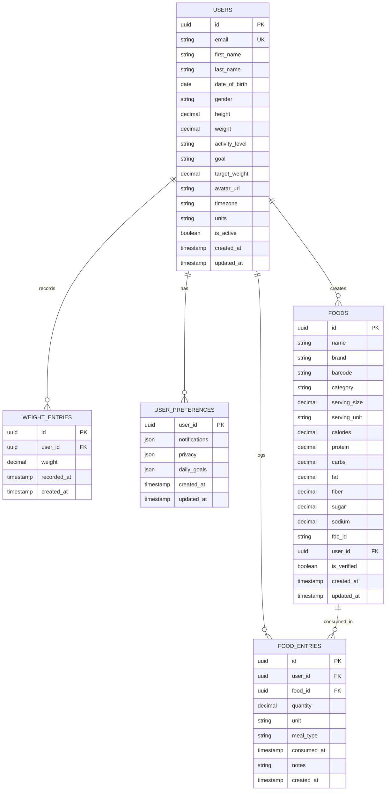

# FitServe Technical Architecture Documentation

## 1. Architecture Design



## 2. Technology Description

- **Frontend**: Vue.js@3 + TypeScript + Tailwind CSS@3 + Vite
- **State Management**: Pinia
- **Routing**: Vue Router v4
- **HTTP Client**: Axios
- **Charts**: Chart.js with vue-chartjs
- **Form Validation**: VeeValidate with Yup
- **Backend**: Express.js@4 + Node.js
- **Database**: Supabase (PostgreSQL)
- **Authentication**: JWT + Supabase Auth
- **External API**: USDA FoodData Central

## 3. Route Definitions

| Route | Purpose |
|-------|----------|
| / | Home page with dashboard overview |
| /login | User login page |
| /register | User registration page |
| /forgot-password | Password reset request |
| /reset-password | Password reset with token |
| /dashboard | Main dashboard with nutrition overview |
| /profile | User profile management |
| /preferences | User preferences and settings |
| /foods/search | Food search and discovery |
| /foods/log | Food logging interface |
| /foods/create | Create custom food items |
| /nutrition/daily | Daily nutrition tracking |
| /nutrition/history | Nutrition history and trends |
| /progress | Weight and progress tracking |
| /goals | Nutrition goals management |

## 4. API Definitions

### 4.1 Authentication API

**User Registration**
```
POST /api/v1/auth/register
```

Request:
| Param Name | Param Type | Required | Description |
|------------|------------|----------|-------------|
| email | string | true | User email address |
| password | string | true | User password (min 8 chars) |
| firstName | string | true | User first name |
| lastName | string | true | User last name |
| dateOfBirth | string | false | Date of birth (YYYY-MM-DD) |
| gender | string | false | Gender (male/female/other) |
| height | number | false | Height in cm |
| weight | number | false | Weight in kg |
| activityLevel | string | false | Activity level |
| goal | string | false | Fitness goal |
| targetWeight | number | false | Target weight in kg |

Response:
```json
{
  "success": true,
  "message": "Registration successful",
  "data": {
    "user": { /* User object */ },
    "token": "jwt_token_here",
    "refreshToken": "refresh_token_here"
  }
}
```

**User Login**
```
POST /api/v1/auth/login
```

Request:
| Param Name | Param Type | Required | Description |
|------------|------------|----------|-------------|
| email | string | true | User email |
| password | string | true | User password |

Response:
```json
{
  "success": true,
  "message": "Login successful",
  "data": {
    "user": { /* User object */ },
    "token": "jwt_token_here",
    "refreshToken": "refresh_token_here"
  }
}
```

### 4.2 User Management API

**Get Current User**
```
GET /api/v1/users/me
```

Headers:
| Header Name | Value |
|-------------|-------|
| Authorization | Bearer {token} |

Response:
```json
{
  "success": true,
  "data": {
    "id": "uuid",
    "email": "user@example.com",
    "firstName": "John",
    "lastName": "Doe",
    "fullName": "John Doe",
    "bmi": 22.5,
    "bmr": 1800,
    "tdee": 2200
  }
}
```

**Update User Profile**
```
PUT /api/v1/users/me
```

Request:
| Param Name | Param Type | Required | Description |
|------------|------------|----------|-------------|
| firstName | string | false | First name |
| lastName | string | false | Last name |
| height | number | false | Height in cm |
| weight | number | false | Weight in kg |
| activityLevel | string | false | Activity level |
| goal | string | false | Fitness goal |
| targetWeight | number | false | Target weight |

### 4.3 Food Management API

**Search Foods**
```
GET /api/v1/foods/search?query={search_term}&limit={limit}&offset={offset}
```

Query Parameters:
| Param Name | Param Type | Required | Description |
|------------|------------|----------|-------------|
| query | string | true | Search term |
| limit | number | false | Results limit (default: 20) |
| offset | number | false | Results offset (default: 0) |
| category | string | false | Food category filter |

Response:
```json
{
  "success": true,
  "data": {
    "foods": [/* Array of food objects */],
    "total": 150,
    "limit": 20,
    "offset": 0
  }
}
```

**Log Food Consumption**
```
POST /api/v1/foods/log
```

Request:
| Param Name | Param Type | Required | Description |
|------------|------------|----------|-------------|
| foodId | string | true | Food UUID |
| quantity | number | true | Quantity consumed |
| unit | string | true | Unit of measurement |
| mealType | string | true | breakfast/lunch/dinner/snack |
| consumedAt | string | false | Consumption timestamp |
| notes | string | false | Additional notes |

### 4.4 Nutrition Analysis API

**Get Daily Nutrition**
```
GET /api/v1/foods/nutrition/daily/{date}
```

Response:
```json
{
  "success": true,
  "data": {
    "date": "2024-01-15",
    "totals": {
      "calories": 2150,
      "protein": 120,
      "carbs": 250,
      "fat": 80,
      "fiber": 25
    },
    "goals": {
      "calories": 2200,
      "protein": 110,
      "carbs": 275,
      "fat": 85
    },
    "entries": [/* Array of food entries */]
  }
}
```

### 4.5 Progress Tracking API

**Record Weight**
```
POST /api/v1/users/me/weight
```

Request:
| Param Name | Param Type | Required | Description |
|------------|------------|----------|-------------|
| weight | number | true | Weight in kg |
| recordedAt | string | false | Recording timestamp |

**Get User Progress**
```
GET /api/v1/users/me/progress
```

Response:
```json
{
  "success": true,
  "data": {
    "weightHistory": [/* Array of weight entries */],
    "streaks": {
      "current": 7,
      "longest": 21
    },
    "achievements": [/* Array of achievements */]
  }
}
```

## 5. Server Architecture Diagram



## 6. Data Model

### 6.1 Data Model Definition



### 6.2 Data Definition Language

**Users Table**
```sql
CREATE TABLE users (
  id UUID DEFAULT gen_random_uuid() PRIMARY KEY,
  email VARCHAR(255) UNIQUE NOT NULL,
  first_name VARCHAR(100) NOT NULL,
  last_name VARCHAR(100) NOT NULL,
  date_of_birth DATE,
  gender VARCHAR(20),
  height DECIMAL(5,2), -- in cm
  weight DECIMAL(5,2), -- in kg
  activity_level VARCHAR(50),
  goal VARCHAR(50),
  target_weight DECIMAL(5,2),
  avatar_url TEXT,
  timezone VARCHAR(100) DEFAULT 'UTC',
  units VARCHAR(20) DEFAULT 'metric',
  is_active BOOLEAN DEFAULT true,
  created_at TIMESTAMP WITH TIME ZONE DEFAULT NOW(),
  updated_at TIMESTAMP WITH TIME ZONE DEFAULT NOW()
);
```

**Foods Table**
```sql
CREATE TABLE foods (
  id UUID DEFAULT gen_random_uuid() PRIMARY KEY,
  name VARCHAR(200) NOT NULL,
  brand VARCHAR(100),
  barcode VARCHAR(50),
  category VARCHAR(100) NOT NULL,
  serving_size DECIMAL(10,2) NOT NULL,
  serving_unit VARCHAR(50) NOT NULL,
  calories DECIMAL(10,2) NOT NULL,
  protein DECIMAL(8,2) DEFAULT 0,
  carbs DECIMAL(8,2) DEFAULT 0,
  fat DECIMAL(8,2) DEFAULT 0,
  fiber DECIMAL(8,2) DEFAULT 0,
  sugar DECIMAL(8,2) DEFAULT 0,
  sodium DECIMAL(8,2) DEFAULT 0,
  cholesterol DECIMAL(8,2) DEFAULT 0,
  saturated_fat DECIMAL(8,2) DEFAULT 0,
  trans_fat DECIMAL(8,2) DEFAULT 0,
  potassium DECIMAL(8,2) DEFAULT 0,
  calcium DECIMAL(8,2) DEFAULT 0,
  iron DECIMAL(8,2) DEFAULT 0,
  vitamin_a DECIMAL(8,2) DEFAULT 0,
  vitamin_c DECIMAL(8,2) DEFAULT 0,
  fdc_id VARCHAR(50),
  user_id UUID REFERENCES users(id) ON DELETE SET NULL,
  is_verified BOOLEAN DEFAULT false,
  created_at TIMESTAMP WITH TIME ZONE DEFAULT NOW(),
  updated_at TIMESTAMP WITH TIME ZONE DEFAULT NOW()
);
```

**Food Entries Table**
```sql
CREATE TABLE food_entries (
  id UUID DEFAULT gen_random_uuid() PRIMARY KEY,
  user_id UUID REFERENCES users(id) ON DELETE CASCADE NOT NULL,
  food_id UUID REFERENCES foods(id) ON DELETE CASCADE NOT NULL,
  quantity DECIMAL(10,2) NOT NULL,
  unit VARCHAR(50) NOT NULL,
  meal_type VARCHAR(20) NOT NULL CHECK (meal_type IN ('breakfast', 'lunch', 'dinner', 'snack')),
  consumed_at TIMESTAMP WITH TIME ZONE DEFAULT NOW(),
  notes TEXT,
  created_at TIMESTAMP WITH TIME ZONE DEFAULT NOW()
);
```

**Weight Entries Table**
```sql
CREATE TABLE weight_entries (
  id UUID DEFAULT gen_random_uuid() PRIMARY KEY,
  user_id UUID REFERENCES users(id) ON DELETE CASCADE NOT NULL,
  weight DECIMAL(5,2) NOT NULL,
  recorded_at TIMESTAMP WITH TIME ZONE DEFAULT NOW(),
  created_at TIMESTAMP WITH TIME ZONE DEFAULT NOW()
);
```

**Indexes for Performance**
```sql
-- Food search optimization
CREATE INDEX idx_foods_name ON foods(name);
CREATE INDEX idx_foods_category ON foods(category);
CREATE INDEX idx_foods_barcode ON foods(barcode);
CREATE INDEX idx_foods_fdc_id ON foods(fdc_id);

-- User data optimization
CREATE INDEX idx_food_entries_user_id ON food_entries(user_id);
CREATE INDEX idx_food_entries_consumed_at ON food_entries(consumed_at);
CREATE INDEX idx_weight_entries_user_id ON weight_entries(user_id);
CREATE INDEX idx_weight_entries_recorded_at ON weight_entries(recorded_at);
```

**Row Level Security Policies**
```sql
-- Enable RLS
ALTER TABLE users ENABLE ROW LEVEL SECURITY;
ALTER TABLE foods ENABLE ROW LEVEL SECURITY;
ALTER TABLE food_entries ENABLE ROW LEVEL SECURITY;
ALTER TABLE weight_entries ENABLE ROW LEVEL SECURITY;

-- Users can only access their own data
CREATE POLICY "Users can manage own profile" ON users FOR ALL USING (auth.uid() = id);

-- Foods are public for read, authenticated users can create
CREATE POLICY "Anyone can view foods" ON foods FOR SELECT USING (true);
CREATE POLICY "Authenticated users can create foods" ON foods FOR INSERT WITH CHECK (auth.role() = 'authenticated');
CREATE POLICY "Users can update own foods" ON foods FOR UPDATE USING (auth.uid() = user_id OR user_id IS NULL);
CREATE POLICY "Users can delete own foods" ON foods FOR DELETE USING (auth.uid() = user_id);

-- Food entries and weight entries are private
CREATE POLICY "Users can manage own food entries" ON food_entries FOR ALL USING (auth.uid() = user_id);
CREATE POLICY "Users can manage own weight entries" ON weight_entries FOR ALL USING (auth.uid() = user_id);
```
