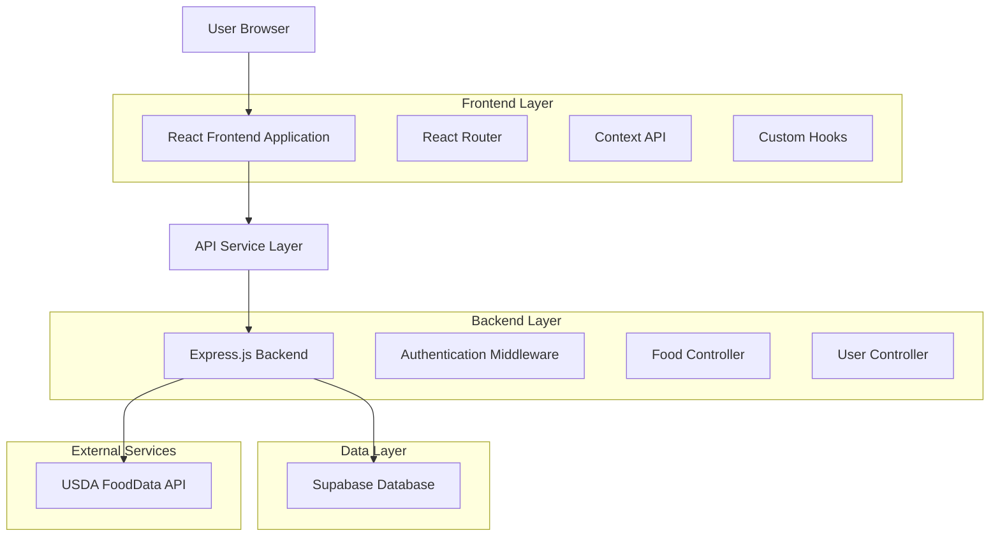
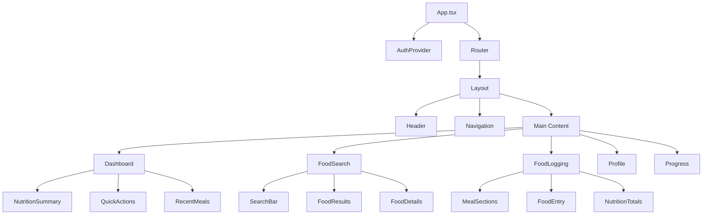

# FitServe Frontend - Technical Architecture Document

## 1. Architecture Design



## 2. Technology Description

* Frontend: React\@19 + TypeScript\@4.9 + React Router\@6 + Axios\@1.6

* Styling: CSS Modules + Material-UI\@5 (or Tailwind CSS\@3)

* State Management: React Context API + useReducer

* Charts: Chart.js\@4 + react-chartjs-2

* Forms: React Hook Form\@7 + Yup validation

* Build Tool: Create React App (React Scripts\@5)

## 3. Route Definitions

| Route                  | Purpose                                               |
| ---------------------- | ----------------------------------------------------- |
| /                      | Dashboard - main nutrition overview and quick actions |
| /login                 | Login page with email/password authentication         |
| /register              | User registration with email verification             |
| /forgot-password       | Password reset request form                           |
| /reset-password/:token | Password reset form with token validation             |
| /verify-email/:token   | Email verification confirmation                       |
| /foods/search          | Food search interface with USDA integration           |
| /foods/create          | Custom food creation form                             |
| /foods/log             | Daily food logging interface                          |
| /profile               | User profile management and settings                  |
| /profile/goals         | Nutrition goals configuration                         |
| /progress              | Progress tracking with charts and analytics           |
| /progress/weight       | Weight history and BMI tracking                       |
| /admin/users           | Admin user management dashboard                       |

## 4. API Definitions

### 4.1 Core API Integration

**Authentication APIs**

```typescript
// POST /api/v1/auth/register
interface RegisterRequest {
  email: string;
  password: string;
  firstName: string;
  lastName: string;
}

interface AuthResponse {
  success: boolean;
  message: string;
  data: {
    user: User;
    token: string;
  };
}
```

**Food Management APIs**

```typescript
// GET /api/v1/foods/search
interface FoodSearchParams {
  q: string;
  category?: string;
  limit?: number;
  offset?: number;
  source?: 'local' | 'usda' | 'all';
}

// POST /api/v1/foods/log
interface FoodLogRequest {
  foodId: string;
  servingSize: number;
  servingUnit: string;
  mealType: 'breakfast' | 'lunch' | 'dinner' | 'snack';
  consumedAt: string;
}
```

**User Profile APIs**

```typescript
// GET /api/v1/users/me
interface UserProfile {
  id: string;
  email: string;
  firstName: string;
  lastName: string;
  height?: number;
  weight?: number;
  age?: number;
  gender?: 'male' | 'female' | 'other';
  activityLevel?: string;
  preferences: UserPreferences;
}

// GET /api/v1/foods/nutrition/daily/:date
interface DailyNutrition {
  date: string;
  totalCalories: number;
  macros: {
    protein: number;
    carbs: number;
    fat: number;
  };
  meals: MealEntry[];
}
```

## 5. Component Architecture



## 6. Data Model

### 6.1 Frontend State Structure

```typescript
interface AppState {
  auth: {
    user: User | null;
    token: string | null;
    isAuthenticated: boolean;
    loading: boolean;
  };
  foods: {
    searchResults: Food[];
    recentFoods: Food[];
    customFoods: Food[];
    loading: boolean;
  };
  nutrition: {
    dailyEntries: FoodEntry[];
    dailyNutrition: DailyNutrition | null;
    goals: NutritionGoals;
    loading: boolean;
  };
  profile: {
    user: UserProfile | null;
    preferences: UserPreferences;
    loading: boolean;
  };
}
```

### 6.2 Core Type Definitions

```typescript
interface User {
  id: string;
  email: string;
  firstName: string;
  lastName: string;
  emailVerified: boolean;
  role: 'user' | 'admin';
  createdAt: string;
}

interface Food {
  id: string;
  name: string;
  brand?: string;
  servingSize: number;
  servingUnit: string;
  nutrition: {
    calories: number;
    protein: number;
    carbs: number;
    fat: number;
    fiber?: number;
    sugar?: number;
    sodium?: number;
  };
  source: 'local' | 'usda' | 'user';
  fdcId?: string;
}

interface FoodEntry {
  id: string;
  foodId: string;
  food: Food;
  servingSize: number;
  mealType: 'breakfast' | 'lunch' | 'dinner' | 'snack';
  consumedAt: string;
  nutrition: NutritionValues;
}

interface NutritionGoals {
  calories: number;
  protein: number;
  carbs: number;
  fat: number;
  fiber?: number;
  sodium?: number;
}

interface UserPreferences {
  units: 'metric' | 'imperial';
  timezone: string;
  dailyGoals: NutritionGoals;
  mealReminders: boolean;
  weekStartsOn: 'sunday' | 'monday';
}
```

## 7. State Management Pattern

### 7.1 Context Providers Structure

```typescript
// AuthContext for authentication state
const AuthContext = createContext<{
  user: User | null;
  login: (email: string, password: string) => Promise<void>;
  logout: () => void;
  register: (data: RegisterRequest) => Promise<void>;
  loading: boolean;
}>({});

// FoodContext for food-related state
const FoodContext = createContext<{
  searchFoods: (query: string) => Promise<Food[]>;
  logFood: (entry: FoodLogRequest) => Promise<void>;
  getDailyEntries: (date: string) => Promise<FoodEntry[]>;
  dailyNutrition: DailyNutrition | null;
}>({});

// ProfileContext for user profile and preferences
const ProfileContext = createContext<{
  profile: UserProfile | null;
  updateProfile: (data: Partial<UserProfile>) => Promise<void>;
  updateGoals: (goals: NutritionGoals) => Promise<void>;
  preferences: UserPreferences;
}>({});
```

### 7.2 Custom Hooks

```typescript
// Authentication hook
const useAuth = () => {
  const context = useContext(AuthContext);
  if (!context) throw new Error('useAuth must be used within AuthProvider');
  return context;
};

// API integration hook
const useApi = () => {
  const { token } = useAuth();
  
  const apiCall = useCallback(async (endpoint: string, options: RequestInit = {}) => {
    const response = await fetch(`/api/v1${endpoint}`, {
      ...options,
      headers: {
        'Content-Type': 'application/json',
        ...(token && { Authorization: `Bearer ${token}` }),
        ...options.headers,
      },
    });
    
    if (!response.ok) {
      throw new Error(`API Error: ${response.statusText}`);
    }
    
    return response.json();
  }, [token]);
  
  return { apiCall };
};

// Form handling hook
const useFormSubmit = <T>(onSubmit: (data: T) => Promise<void>) => {
  const [loading, setLoading] = useState(false);
  const [error, setError] = useState<string | null>(null);
  
  const handleSubmit = useCallback(async (data: T) => {
    setLoading(true);
    setError(null);
    
    try {
      await onSubmit(data);
    } catch (err) {
      setError(err instanceof Error ? err.message : 'An error occurred');
    } finally {
      setLoading(false);
    }
  }, [onSubmit]);
  
  return { handleSubmit, loading, error };
};
```

## 8. Error Handling Strategy

### 8.1 Global Error Boundary

```typescript
class ErrorBoundary extends Component<{children: ReactNode}, {hasError: boolean}> {
  constructor(props: {children: ReactNode}) {
    super(props);
    this.state = { hasError: false };
  }
  
  static getDerivedStateFromError(error: Error) {
    return { hasError: true };
  }
  
  componentDidCatch(error: Error, errorInfo: ErrorInfo) {
    console.error('Application error:', error, errorInfo);
    // Log to error reporting service
  }
  
  render() {
    if (this.state.hasError) {
      return <ErrorFallback />;
    }
    
    return this.props.children;
  }
}
```

### 8.2 API Error Handling

```typescript
const handleApiError = (error: any) => {
  if (error.response?.status === 401) {
    // Redirect to login
    window.location.href = '/login';
  } else if (error.response?.status === 403) {
    // Show access denied message
    toast.error('Access denied');
  } else if (error.response?.status >= 500) {
    // Show server error message
    toast.error('Server error. Please try again later.');
  } else {
    // Show generic error message
    toast.error(error.message || 'An unexpected error occurred');
  }
};
```

## 9. Performance Optimization

### 9.1 Code Splitting

```typescript
// Lazy load route components
const Dashboard = lazy(() => import('./pages/Dashboard'));
const FoodSearch = lazy(() => import('./pages/FoodSearch'));
const Profile = lazy(() => import('./pages/Profile'));

// Wrap in Suspense
<Suspense fallback={<LoadingSpinner />}>
  <Routes>
    <Route path="/" element={<Dashboard />} />
    <Route path="/foods/search" element={<FoodSearch />} />
    <Route path="/profile" element={<Profile />} />
  </Routes>
</Suspense>
```

### 9.2 Data Caching

```typescript
// Simple cache implementation
const useCache = <T>(key: string, fetcher: () => Promise<T>, ttl = 300000) => {
  const [data, setData] = useState<T | null>(null);
  const [loading, setLoading] = useState(false);
  
  useEffect(() => {
    const cached = localStorage.getItem(key);
    if (cached) {
      const { data: cachedData, timestamp } = JSON.parse(cached);
      if (Date.now() - timestamp < ttl) {
        setData(cachedData);
        return;
      }
    }
    
    setLoading(true);
    fetcher().then(result => {
      setData(result);
      localStorage.setItem(key, JSON.stringify({
        data: result,
        timestamp: Date.now()
      }));
    }).finally(() => setLoading(false));
  }, [key, fetcher, ttl]);
  
  return { data, loading };
};
```

