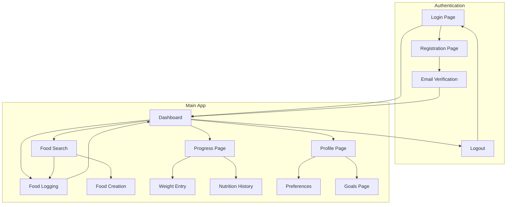

# FitServe Frontend Flow Documentation

## 1. Product Overview
FitServe is a comprehensive nutrition tracking and fitness management web application that helps users monitor their food intake, track nutritional goals, and manage their health progress. The frontend provides an intuitive interface for food logging, nutrition analysis, progress visualization, and personalized health insights.

## 2. Core Features

### 2.1 User Roles
| Role | Registration Method | Core Permissions |
|------|---------------------|------------------|
| Regular User | Email registration with verification | Full access to all features: food logging, nutrition tracking, progress monitoring, advanced analytics, custom nutrition goals, data export, profile management |

### 2.2 Feature Module
Our FitServe frontend consists of the following main pages:
1. **Landing Page**: hero section, feature highlights, authentication entry points
2. **Authentication Pages**: login form, registration form, password reset, email verification
3. **Dashboard**: nutrition overview, daily summary, quick actions, progress charts
4. **Food Logging**: food search, barcode scanner, manual entry, meal planning
5. **Food Database**: personal foods, USDA food search, custom food creation
6. **Progress Tracking**: weight logging, nutrition trends, goal tracking, statistics
7. **Profile Management**: user settings, nutrition goals, preferences, account management

### 2.3 Page Details

| Page Name | Module Name | Feature Description |
|-----------|-------------|---------------------|
| **Login Page** | Authentication Form | Email/password login with validation, forgot password link, registration redirect |
| **Login Page** | Error Handling | Display authentication errors, rate limiting messages |
| **Registration Page** | User Registration Form | Email, password, personal details (name, DOB, gender, height, weight), activity level, fitness goals |
| **Registration Page** | Email Verification | Send verification email, resend verification option |
| **Dashboard Page** | Nutrition Overview | Daily calorie/macro progress bars, meal breakdown (breakfast/lunch/dinner/snacks) |
| **Dashboard Page** | Quick Actions | Log food button, add weight button, view goals button |
| **Dashboard Page** | Progress Summary | Current weight, BMI display, streak counter |
| **Food Search Page** | Search Interface | Search local foods and USDA database, filter by category, pagination |
| **Food Search Page** | Food Results | Display nutrition facts, serving sizes, add to log functionality |
| **Food Search Page** | USDA Integration | Import USDA foods to local database, real-time API status |
| **Food Logging Page** | Meal Selection | Choose meal type (breakfast/lunch/dinner/snack), quantity input, unit selection |
| **Food Logging Page** | Entry Management | Edit logged entries, delete entries, add notes |
| **Food Creation Page** | Custom Food Form | Name, brand, category, nutrition facts input, serving size definition |
| **Food Creation Page** | Barcode Scanner | Scan product barcodes, auto-populate food data |
| **Profile Page** | Personal Information | Edit name, email, physical stats (height/weight), activity level |
| **Profile Page** | Account Settings | Change password, delete account, avatar upload |
| **Preferences Page** | Notification Settings | Meal reminders, daily goal alerts, weekly reports |
| **Preferences Page** | Privacy Settings | Profile visibility, progress sharing options |
| **Goals Page** | Nutrition Goals | Set/edit daily calorie and macro targets, goal calculation based on profile |
| **Goals Page** | Fitness Goals | Weight loss/gain/maintenance targets, timeline setting |
| **Progress Page** | Weight Tracking | Log weight entries, view weight history chart, BMI trends |
| **Progress Page** | Achievement System | Streak tracking, milestone celebrations, progress statistics |
| **Nutrition History Page** | Daily Summaries | View past nutrition data, compare against goals, export data |
| **Nutrition History Page** | Trend Analysis | Weekly/monthly nutrition trends, macro distribution charts |

## 3. Core Process

### 3.1 User Authentication Flow
**New User Registration:**
1. User visits registration page and provides email, password, and basic profile information
2. System validates input and creates account with email verification
3. User receives verification email and confirms account
4. User completes profile setup with physical stats and fitness goals
5. System calculates BMR, TDEE, and nutrition goals
6. User is redirected to dashboard

**Existing User Login:**
1. User enters email and password on login page
2. System validates credentials and generates JWT tokens
3. User is redirected to dashboard with authenticated session

### 3.2 Daily Nutrition Tracking Flow
**Food Logging Process:**
1. User accesses food search from dashboard or dedicated page
2. User searches for food items (local database + USDA API)
3. User selects food item and specifies quantity/serving size
4. User chooses meal type (breakfast/lunch/dinner/snack)
5. System calculates nutrition values and logs entry
6. Dashboard updates with new nutrition totals

**Custom Food Creation:**
1. User navigates to food creation page
2. User inputs food details (name, brand, nutrition facts)
3. System validates and saves custom food to database
4. Food becomes available for future logging

### 3.3 Progress Tracking Flow
**Weight Management:**
1. User logs current weight from dashboard or progress page
2. System records weight entry with timestamp
3. System updates BMI and progress calculations
4. Weight history chart reflects new data point

**Goal Setting and Monitoring:**
1. User accesses goals page to set nutrition targets
2. System provides calculated recommendations based on profile
3. User can customize goals or accept recommendations
4. Dashboard displays daily progress against goals

### 3.4 Page Navigation Flow



## 4. Backend API Integration

### 4.1 Authentication Endpoints
Based on actual backend implementation:

**Public Authentication Routes:**
- `POST /api/v1/auth/register` - User registration
- `POST /api/v1/auth/login` - User login
- `POST /api/v1/auth/refresh` - Token refresh
- `POST /api/v1/auth/forgot-password` - Password reset request
- `POST /api/v1/auth/reset-password` - Password reset with token
- `POST /api/v1/auth/verify-email` - Email verification
- `POST /api/v1/auth/resend-verification` - Resend verification email
- `GET /api/v1/auth/verify-token` - Token validation
- `GET /api/v1/auth/check-email/:email` - Email availability check

**Protected Authentication Routes:**
- `POST /api/v1/auth/logout` - User logout
- `POST /api/v1/auth/change-password` - Password change
- `GET /api/v1/auth/me` - Authentication status

### 4.2 User Management Endpoints

**Profile Management:**
- `GET /api/v1/users/me` - Get current user profile with calculated metrics
- `PUT /api/v1/users/me` - Update user profile
- `DELETE /api/v1/users/me` - Delete account (soft delete)

**Preferences & Settings:**
- `GET /api/v1/users/me/preferences` - Get user preferences
- `PUT /api/v1/users/me/preferences` - Update preferences

**Nutrition Goals:**
- `GET /api/v1/users/me/goals` - Get calculated nutrition goals
- `PUT /api/v1/users/me/goals` - Update custom goals

**Progress Tracking:**
- `GET /api/v1/users/me/progress` - Get progress data
- `POST /api/v1/users/me/weight` - Record weight entry
- `GET /api/v1/users/me/stats` - Get user statistics

**File Upload:**
- `POST /api/v1/users/me/avatar` - Upload avatar image

### 4.3 Food Management Endpoints

**Public Food Routes:**
- `GET /api/v1/foods/categories` - Get food categories
- `GET /api/v1/foods/search` - Search foods (enhanced for authenticated users)
- `GET /api/v1/foods/:id` - Get food by ID

**USDA Integration:**
- `GET /api/v1/foods/usda/status` - USDA API status
- `GET /api/v1/foods/usda/search` - Search USDA database
- `GET /api/v1/foods/usda/:fdcId` - Get USDA food details
- `POST /api/v1/foods/usda/:fdcId/import` - Import USDA food

**Protected Food Routes:**
- `POST /api/v1/foods` - Create food item
- `PUT /api/v1/foods/:id` - Update food item
- `DELETE /api/v1/foods/:id` - Delete food item
- `GET /api/v1/foods/entries` - Get user's food entries

**Food Logging:**
- `POST /api/v1/foods/log` - Log food consumption

**Nutrition Analysis:**
- `GET /api/v1/foods/nutrition/daily/:date` - Daily nutrition summary
- `GET /api/v1/foods/nutrition/range` - Nutrition range summary

### 4.4 Data Models

**User Model:**
```typescript
interface User {
  id: string;
  email: string;
  firstName: string;
  lastName: string;
  fullName: string;
  dateOfBirth?: string;
  gender?: 'male' | 'female' | 'other';
  height?: number; // cm
  weight?: number; // kg
  activityLevel?: 'sedentary' | 'lightly_active' | 'moderately_active' | 'very_active' | 'extra_active';
  goal?: 'weight_loss' | 'weight_gain' | 'maintain';
  targetWeight?: number;
  avatarUrl?: string;
  timezone: string;
  units: 'metric' | 'imperial';
  isActive: boolean;
  bmi?: number;
  bmr?: number;
  tdee?: number;
  createdAt: string;
  updatedAt: string;
}
```

**Food Model:**
```typescript
interface Food {
  id: string;
  name: string;
  brand?: string;
  barcode?: string;
  category: string;
  servingSize: number;
  servingUnit: string;
  nutrition: {
    calories: number;
    protein: number;
    carbs: number;
    fat: number;
    fiber: number;
    sugar: number;
    sodium: number;
    cholesterol: number;
    saturatedFat: number;
    transFat: number;
    potassium: number;
    calcium: number;
    iron: number;
    vitaminA: number;
    vitaminC: number;
  };
  fdcId?: string;
  userId?: string;
  isVerified: boolean;
  createdAt: string;
  updatedAt: string;
}
```

**Food Entry Model:**
```typescript
interface FoodEntry {
  id: string;
  userId: string;
  foodId: string;
  quantity: number;
  unit: string;
  mealType: 'breakfast' | 'lunch' | 'dinner' | 'snack';
  consumedAt: string;
  notes?: string;
  createdAt: string;
}
```

**Weight Entry Model:**
```typescript
interface WeightEntry {
  id: string;
  userId: string;
  weight: number;
  recordedAt: string;
  createdAt: string;
}
```

**User Preferences Model:**
```typescript
interface UserPreferences {
  userId: string;
  notifications: {
    mealReminders: boolean;
    dailyGoals: boolean;
    weeklyReports: boolean;
  };
  privacy: {
    profilePublic: boolean;
    shareProgress: boolean;
  };
  dailyGoals: {
    calories?: number;
    protein?: number;
    carbs?: number;
    fat?: number;
    fiber?: number;
    water?: number;
  };
  createdAt: string;
  updatedAt: string;
}
```

## 5. User Interface Design
### 5.1 Design Style
Core elements of the overall UI design style:
- Primary colors: Green (#10B981), Blue (#3B82F6)
- Secondary colors: Gray (#6B7280), Light Gray (#F3F4F6)
- Button style: Rounded corners with subtle shadows
- Font: Inter or system fonts, 14-16px base size
- Layout style: Card-based design with clean navigation
- Icons: Heroicons or Lucide icons for consistency

### 4.2 Page Design Overview
| Page Name | Module Name | UI Elements |
|-----------|-------------|-------------|
| Landing Page | Hero Section | Large heading, subtitle, gradient background, CTA buttons |
| Dashboard | Nutrition Cards | Progress rings, percentage indicators, color-coded macros |
| Food Logging | Search Interface | Search bar with filters, grid layout for results, quick add buttons |
| Progress Tracking | Charts | Line charts for trends, bar charts for daily intake, responsive design |
| Profile | Settings Forms | Clean form layouts, toggle switches, save/cancel buttons |

### 4.3 Responsiveness
Mobile-first responsive design with breakpoints at 640px (sm), 768px (md), 1024px (lg), and 1280px (xl). Touch-optimized interactions for mobile devices with larger tap targets and swipe gestures.

## 5. Frontend Architecture

### 5.1 Technology Stack
- **Framework**: Vue 3 with TypeScript
- **Styling**: Tailwind CSS 3
- **State Management**: Pinia for global state
- **Routing**: Vue Router v4
- **HTTP Client**: Axios with interceptors
- **Charts**: Chart.js with vue-chartjs for data visualization
- **Forms**: VeeValidate with Yup validation
- **Build Tool**: Vite

### 5.2 Component Architecture
```
src/
├── components/
│   ├── ui/           # Reusable UI components
│   ├── forms/        # Form components
│   ├── charts/       # Chart components
│   └── layout/       # Layout components
├── views/            # Page components
├── composables/      # Custom Vue composables
├── stores/           # Pinia stores
├── services/         # API services
├── utils/            # Utility functions
└── types/            # TypeScript types
```

### 5.3 State Management Structure (Pinia)
- **Auth Store**: User authentication state, login/logout actions
- **Food Store**: Food database, search results, recent foods
- **Nutrition Store**: Daily intake, meal entries, nutrition goals
- **Progress Store**: Weight entries, statistics, trend data
- **UI Store**: Loading states, modals, notifications

## 6. API Integration

### 6.1 Authentication Integration
- **Login**: POST /api/auth/login
- **Register**: POST /api/auth/register
- **Refresh Token**: POST /api/auth/refresh
- **Logout**: POST /api/auth/logout
- **Password Reset**: POST /api/auth/forgot-password

### 6.2 User Management Integration
- **Get Profile**: GET /api/users/profile
- **Update Profile**: PUT /api/users/profile
- **Get Preferences**: GET /api/users/preferences
- **Update Goals**: PUT /api/users/nutrition-goals

### 6.3 Food Management Integration
- **Search Foods**: GET /api/foods/search
- **Get Food Details**: GET /api/foods/:id
- **Create Custom Food**: POST /api/foods
- **Log Food Entry**: POST /api/foods/entries
- **Get Daily Summary**: GET /api/foods/nutrition/daily

### 6.4 Progress Tracking Integration
- **Log Weight**: POST /api/users/weight
- **Get Progress**: GET /api/users/progress
- **Get Statistics**: GET /api/users/statistics

## 7. User Experience Flows

### 7.1 First-Time User Journey
1. **Discovery**: User lands on homepage, sees value proposition
2. **Registration**: Creates account with email verification
3. **Onboarding**: Sets up profile, nutrition goals, preferences
4. **First Log**: Guided food logging experience
5. **Dashboard**: Views personalized dashboard with initial data

### 7.2 Daily User Journey
1. **Login**: Quick authentication or auto-login
2. **Dashboard Review**: Check yesterday's summary and today's goals
3. **Food Logging**: Log meals throughout the day
4. **Progress Check**: Review nutrition progress and trends
5. **Goal Adjustment**: Modify goals based on progress

### 7.3 Advanced User Journey
1. **Bulk Operations**: Import foods, batch logging
2. **Advanced Analytics**: Deep dive into nutrition trends
3. **Custom Foods**: Create and manage personal food database
4. **Goal Optimization**: Fine-tune nutrition targets
5. **Data Export**: Export progress data for external analysis

## 8. Error Handling & Loading States

### 8.1 Error Boundaries
- Page-level error boundaries for graceful failure handling
- Component-level error states for API failures
- Toast notifications for user feedback

### 8.2 Loading States
- Skeleton screens for initial page loads
- Spinner indicators for form submissions
- Progressive loading for large datasets
- Optimistic updates for better UX

### 8.3 Offline Support
- Service worker for basic offline functionality
- Local storage for critical user data
- Sync queue for offline actions

## 9. Performance Optimization

### 9.1 Code Splitting
- Route-based code splitting
- Component lazy loading
- Dynamic imports for heavy libraries

### 9.2 Data Management
- Pinia with persistence for server state caching
- Debounced search inputs using Vue composables
- Virtual scrolling for large datasets
- Image optimization and lazy loading

### 9.3 Bundle Optimization
- Tree shaking for unused code elimination
- Compression and minification
- CDN integration for static assets

## 10. Security Considerations

### 10.1 Authentication Security
- JWT token storage in httpOnly cookies
- Automatic token refresh
- Session timeout handling
- CSRF protection

### 10.2 Data Validation
- Client-side form validation
- Input sanitization
- XSS prevention
- API response validation

### 10.3 Privacy Protection
- Secure data transmission (HTTPS)
- Minimal data collection
- User consent management
- Data anonymization options

This documentation serves as the complete guide for implementing the FitServe frontend, ensuring a cohesive user experience that seamlessly integrates with the existing backend infrastructure.