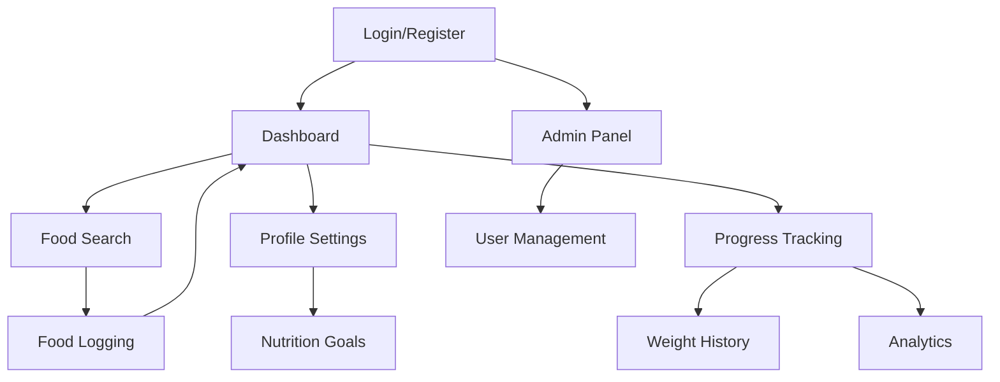

# FitServe Frontend - Product Requirements Document

## 1. Product Overview

FitServe is a comprehensive fitness and nutrition tracking web application that helps users monitor their food intake, track nutritional goals, and maintain healthy eating habits. The frontend provides an intuitive interface for users to log meals, search foods via USDA database integration, set personalized nutrition goals, and visualize their progress over time.

The application serves fitness enthusiasts, health-conscious individuals, and anyone looking to maintain better nutritional awareness through detailed food logging and progress tracking.

## 2. Core Features

### 2.1 User Roles

| Role         | Registration Method                  | Core Permissions                                                   |
| ------------ | ------------------------------------ | ------------------------------------------------------------------ |
| Regular User | Email registration with verification | Can log foods, track nutrition, manage profile, view personal data |
| Admin User   | Admin invitation/promotion           | Can manage all users, view system analytics, moderate content      |

### 2.2 Feature Module

Our FitServe frontend consists of the following main pages:

1. **Authentication Pages**: login, registration, password reset, email verification
2. **Dashboard**: nutrition overview, daily progress, quick food logging
3. **Food Search & Management**: USDA food search, custom food creation, food library
4. **Food Logging**: meal entry, portion tracking, daily food diary
5. **Profile Management**: personal information, preferences, nutrition goals
6. **Progress Tracking**: weight history, nutrition trends, goal achievement
7. **Admin Panel**: user management, system overview (admin only)

### 2.3 Page Details

| Page Name         | Module Name         | Feature description                                                                   |
| ----------------- | ------------------- | ------------------------------------------------------------------------------------- |
| Login Page        | Authentication Form | Email/password login, remember me option, forgot password link, registration redirect |
| Registration Page | User Registration   | Email, password, confirm password, basic profile info, email verification trigger     |
| Password Reset    | Password Recovery   | Email input, reset token validation, new password form                                |
| Dashboard         | Daily Overview      | Today's nutrition summary, calorie progress bar, recent meals, quick add buttons      |
| Dashboard         | Quick Actions       | Fast food logging, weight entry, goal progress widgets                                |
| Food Search       | USDA Integration    | Real-time food search, nutrition facts display, portion calculator                    |
| Food Search       | Custom Foods        | Create custom food items, edit nutrition values, save to personal library             |
| Food Logging      | Meal Entry          | Add foods to meals (breakfast, lunch, dinner, snacks), portion adjustment             |
| Food Logging      | Daily Diary         | View all logged foods for selected date, edit/delete entries, nutrition totals        |
| Profile Settings  | Personal Info       | Height, weight, age, gender, activity level, dietary preferences                      |
| Profile Settings  | Nutrition Goals     | Calorie targets, macro ratios, custom nutrient goals                                  |
| Progress Tracking | Weight History      | Weight entry form, weight trend chart, BMI calculation                                |
| Progress Tracking | Nutrition Analytics | Daily/weekly/monthly nutrition charts, goal achievement tracking                      |
| Admin Panel       | User Management     | Search users, view user details, account status management                            |

## 3. Core Process

**Regular User Flow:**

1. User registers account and verifies email
2. User completes profile setup (height, weight, goals)
3. User searches and logs foods throughout the day
4. User views daily nutrition summary and progress
5. User tracks weight and reviews long-term trends

**Admin Flow:**

1. Admin logs in with elevated privileges
2. Admin accesses user management dashboard
3. Admin can view, search, and manage user accounts
4. Admin monitors system usage and content

## 4. User Interface Design

### 4.1 Design Style

* **Primary Colors**: #4CAF50 (green) for health/success, #2196F3 (blue) for actions

* **Secondary Colors**: #FFC107 (amber) for warnings, #F44336 (red) for errors

* **Button Style**: Rounded corners (8px), subtle shadows, hover animations

* **Typography**: Inter font family, 16px base size, clear hierarchy

* **Layout Style**: Card-based design, clean white backgrounds, generous spacing

* **Icons**: Material Design icons, consistent 24px size, outlined style

### 4.2 Page Design Overview

| Page Name         | Module Name      | UI Elements                                                                          |
| ----------------- | ---------------- | ------------------------------------------------------------------------------------ |
| Dashboard         | Daily Overview   | Progress circles for calories/macros, color-coded nutrition bars, recent meals cards |
| Dashboard         | Quick Actions    | Large action buttons with icons, floating add button, swipe gestures                 |
| Food Search       | Search Interface | Auto-complete search bar, filter chips, infinite scroll results                      |
| Food Search       | Food Details     | Nutrition facts table, portion selector, visual serving sizes                        |
| Food Logging      | Meal Sections    | Collapsible meal categories, drag-drop reordering, quick edit buttons                |
| Profile Settings  | Form Layout      | Tabbed sections, inline validation, progress indicators                              |
| Progress Tracking | Charts           | Interactive line/bar charts, date range picker, export options                       |

### 4.3 Responsiveness

The application is mobile-first responsive design with:

* Touch-optimized interactions for mobile devices

* Adaptive layouts for tablet and desktop screens

* Swipe gestures for navigation and quick actions

* Optimized form inputs for mobile keyboards

